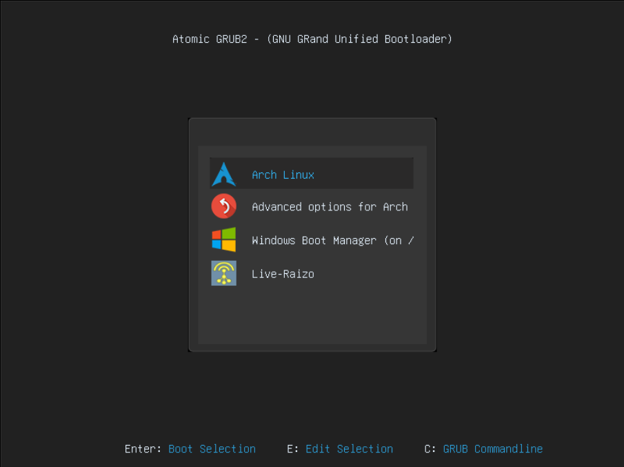

# Adding Live Raizo Automatically
To add Live Raizo with this script, you need:

* An Internet conection
* Grub2
* Python 3 (Last Version)
* sudoer user

## Running the Script
To run the script, open the terminal in the script directory and type the next command:

```bash
sudo python AddRaizo.py
#or
sudo python3 AddRaizo.py
```
<p align="center">
  
</p>

After running it, reboot your system and Live-Raizo will be appear in the grub menu
