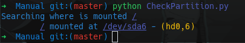
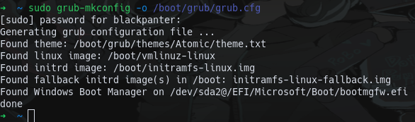

# Adding Live Raizo Manually
To add Live Raizo you need to follow the next steps

* Check the partition number where is mounted /
* Download the last version of Live Raizo iso
* Create the /boot-isos directory
* Add the menu Entry
* Update Grub

## Check the partition number where is mounted /
To know where is mounted / you can use [GParted](https://gparted.org/) or another method that you want, alternatively you can use the script named *CheckPartition.py*

**NOTE:** If you use GParted or another method, consider this:
```
/dev/sdxy where:

* x it's the letter of the HDD
* y it's the partition number

The letter is a reference to HDD number (a = 0, b = 1, etc)

For example: if / is mounted in /dev/sda1, you have / mount in the HDD 0 in the partition number 1
```
**Using CheckPartition.py**
<p align="center">
  
</p>

## Download the last version of Live Raizo iso
Download the last version [Here](https://sourceforge.net/projects/live-raizo/) or you can download it using *wget*

```bash
wget https://sourceforge.net/projects/live-raizo/files/latest/download
```

## Create the /boot-isos directory
Open a terminal and type the next command

```bash
sudo mkdir /boot-isos
```
and move the iso of Live Raizo to that directory

```bash
sudo mv /path/to/live/raizo/iso /boot-isos/Live-Raizo.iso
```

## Add the menu Entry
To add the menu entry, you need to open the file */etc/grub.d/40_custom* and add the next (you can also copy the file 40_custom ubicated in this folder)

```
menuentry "Live-Raizo" --class live-raizo --class debian --class gnu-linux --class gnu --class os {
	echo "Loading Live-Raizo ISO"
	insmod iso9660
	set isofile="/boot-isos/Live-Raizo.iso"
	loopback loop (hd0,6)$isofile
	linux (loop)/live/vmlinuz locale=es_MX.UTF-8 keyboard-layouts=latam boot=live union=overlay components noconfig=sudo username=user hostname=raizo user-fullname=Live-Raizo-User findiso=$isofile debug --verbose ip=frommedia vga=791 persistence
	initrd (loop)/live/initrd.img
}
```
**NOTE:** In the line *loopback loop (hd0,6)$isofile* change (hd0,6) to your HDD number and partition number where is mounted / (found in the first step)
For exmaple: (hd0,1)<br/>
Also you can change the locale and keyboard-layout for that you want

After add the menu entry, give the permission to the file

```bash
sudo chmod 744 /etc/grub.d/40_custom
```
## Update Grub
Finally you need to update the grub, you can do this using the next command:

```bash
sudo grub-mkconfig -o /boot/grub/grub.cfg
```
<p align="center">
  
</p>