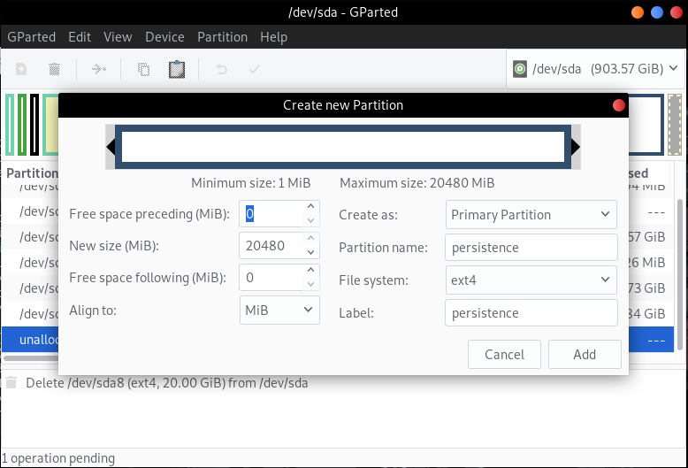

# Add Persistence to Live Raizo
To add Persistence to Live Raizo you need to follow the next steps

* Create a new partition etx4 with persistence label
* Create a persistence.conf file in persistence partition

## Create a new partition etx4 with persistence label
you can use [GParted](https://gparted.org/) or another method to create the partition an set it the label "persistence"

**using GParted to create the partition**
<p align="center">
  
</p>

## Create a persistence.conf file in persistence partition
create the persistence.conf file with the next content

```
/ union

```

and put in the persistence partition (you can also use the persistence.conf file ubicated in this folder)