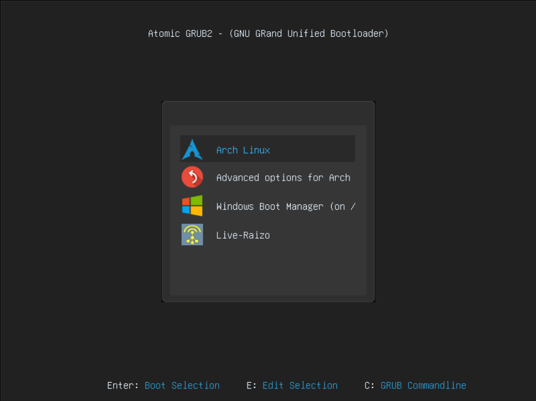

# Add Live Raizo
To add Live Raizo in your Linux System you need to make some configurations in a certain files, download the iso, add a manu entry, etc.

* If you don't want to made this manually, you can run the Python3 script ubicated in "Automatic" folder
* If you want to made the changes without the script, use the "Manual" folder to know how to add Live Raizo in your Linux System

## Add Persistence to Live Raizo
Use the "Persistence" folder to add the persistence in Live Raizo

## Preview

  

test
